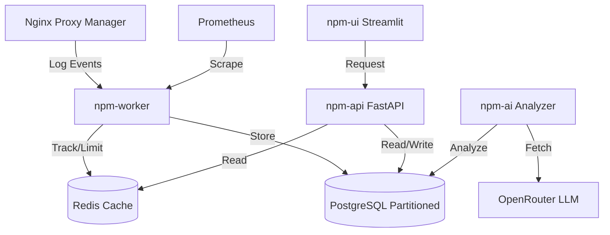

# Enterprise Architecture (v2.0.0)

## System Overview

The NPM Monitor has evolved from a monolithic container structure into a high-performance, microservice-oriented security platform. It utilizes event-driven processing and a multi-tier caching layer to handle high traffic volumes with minimal latency.

## Core Components

### 1. Data Access Layer (`npm-api`)
- **Framework**: FastAPI
- **Responsibility**: Provides a unified REST interface for all system data.
- **Benefits**: Decouples the presentation layer (UI) from the database, allowing for third-party integrations and better scalability.

### 2. Real-Time Processing Layer (`npm-worker`)
- **Technology**: `watchdog` (Event-driven file monitoring).
- **Responsibility**: Listens for file system changes in NPM logs. No more periodic polling.
- **Metrics**: Exposes internal performance metrics on port 8000 for Prometheus.

### 3. High-Speed Cache (`redis`)
- **Responsibility**: Stores ephemeral request counters, rate-limit buckets, and temporary IP tracking data.
- **Impact**: Reduces database write IOPS by over 90%, as only permanent blocks and persistent traffic logs are written to PostgreSQL.

### 4. Intelligence Layer (`npm-ai`)
- **Daily Briefings**: A new autonomous task that summarizes system state every 24 hours.
- **Structured Analysis**: Uses LLM JSON-mode for precise threat classification (High/Medium/Low/Critical).

### 5. Data Integrity & Scaling
- **Partitioning**: The `traffic` table is now partitioned by time (e.g., monthly). This allows for instant deletion of old data by dropping partitions instead of expensive `DELETE` queries.
- **Archiving**: Logs older than the retention period are automatically exported to compressed CSV files (`archives/`) before removal.

## Security Model: Multi-Tier Defense

1. **Deceptive Tier (Honeypots)**: Immediate 1-year ban for anyone touching high-value bait paths.
2. **Heuristic Tier (WAF)**: Fast regex matching for SQLi, XSS, and known malicious User-Agents.
3. **Community Tier (CrowdSec)**: Reputation checks against millions of known bad actors.
4. **Cognitive Tier (AI)**: Behavioral assessment of intention using deep log history.
5. **Edge Tier (Cloudflare)**: Pushing bans to the edge to protect server resources.

## Performance Design
- **Connection Pooling**: Via `psycopg_pool`.
- **Atomic Increments**: Redis `INCR` commands for thread-safe rate limiting.
- **Alembic**: Structured database schema evolution.
